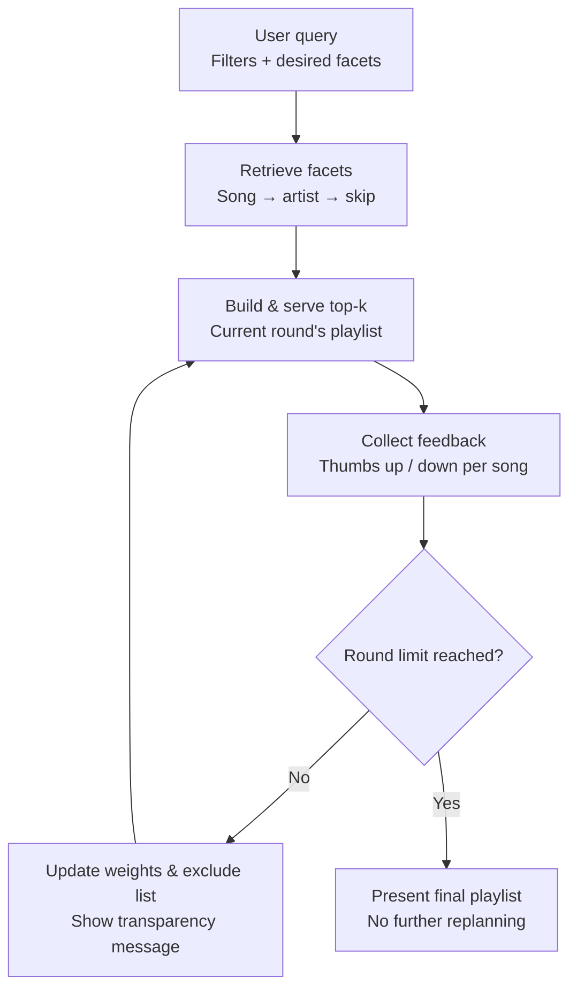
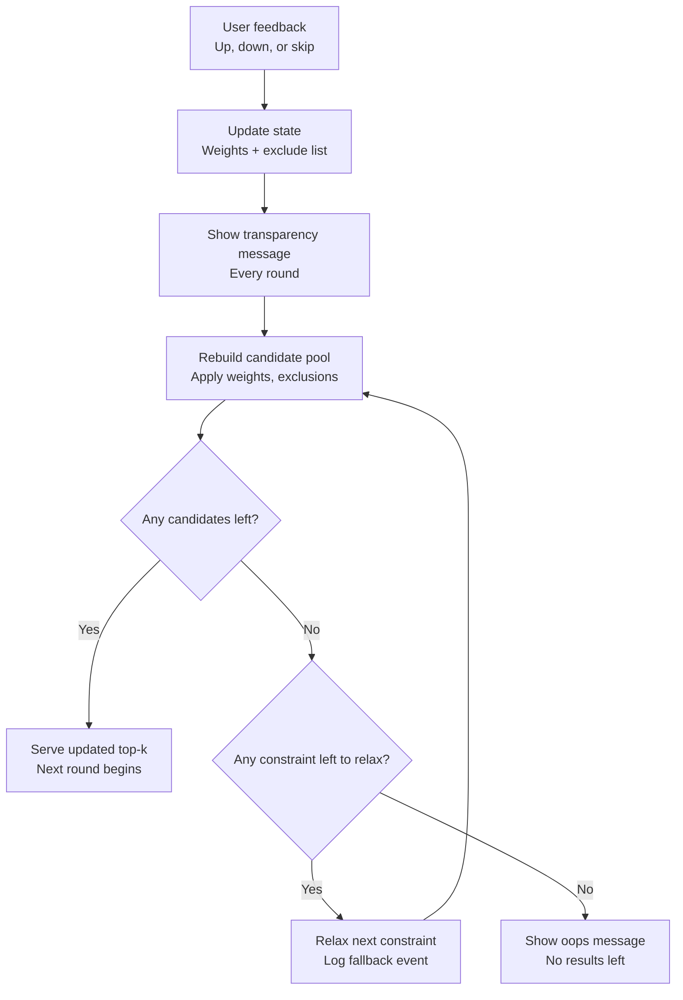
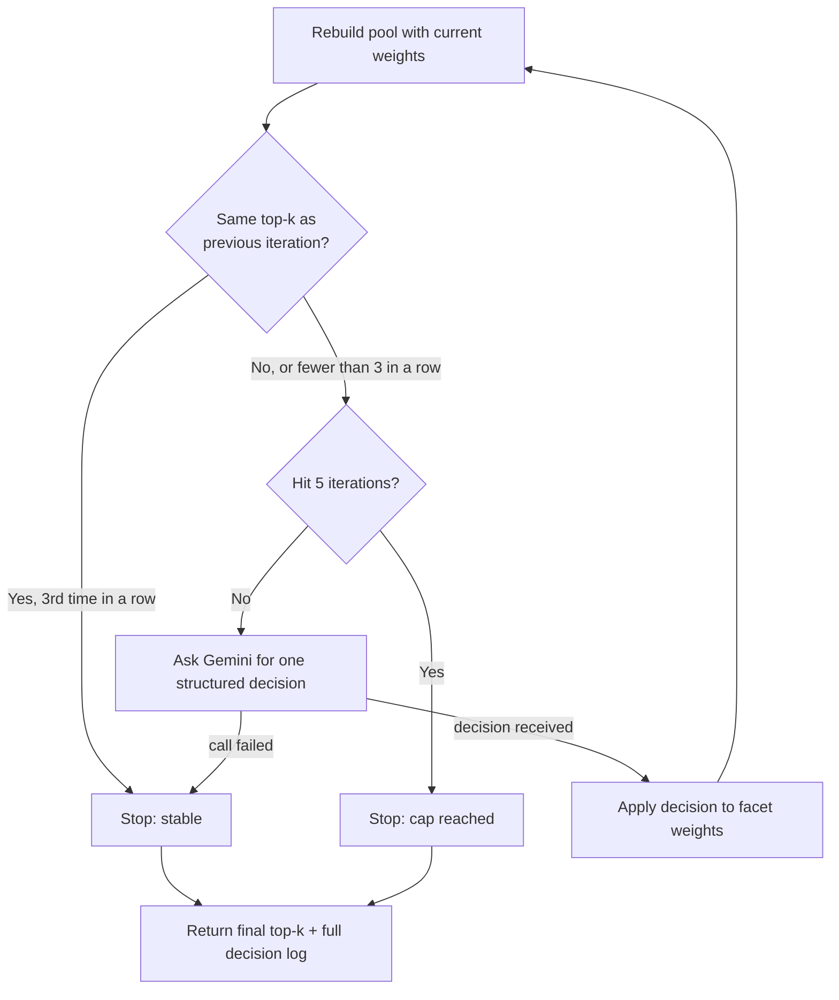

# Agentic recommendation loop — design spec

## 1. Context

Terminal-based music recommendation app (currently dummy data, moving to real
data + a real interface). This spec adds two things to the existing
recommender: an **agentic feedback loop** (plan → serve → observe → interpret →
replan) and **structured error/event logging** across that loop. This is the
"final project" deliverable layer on top of the existing `_score()` /
`_score_song_for_user()` scoring core.

## 2. Locked-in design decisions

- **Scope of facet weights**: per-query only. No persisted/long-term user
  weights across sessions — keeps the project scoped appropriately.
- **Thumbs down**: hard-excludes that exact song for the rest of the session,
  *and* down-weights its matched facets.
- **Thumbs up**: up-weights the song's matched facets. Not a hard pin — the
  song can still be replaced next round if something scores higher.
- **Replan trigger**: after *every single* thumbs up/down (no batching
  multiple feedback events before regenerating).
- **Loop termination**: fixed number of rounds (`max_rounds`). When reached,
  auto-stop and present the final playlist — no more replanning after that.
- **"Enough candidates?" check**: a simple existence check ("are there any
  candidates left"), not a fuzzy/soft quality threshold.
- **Pool exhaustion handling**: relax constraints one at a time, in priority
  order, logging each relaxation as a fallback event, then retry the pool
  rebuild.
- **Total exhaustion**: if all relaxable constraints are exhausted and the
  pool is still empty, show a terminal "oops, no results left" message and end
  the loop early (this round does not get a top-k).
- **Transparency message**: shown **every round**, not conditionally on a
  large weight shift. Rationale: keeps the user anchored in the loop, and lets
  them notice/self-correct ("oh, I didn't mean to tank grunge that hard, I
  just wasn't in the mood for that one song").
- **Facet enrichment source**: Spotify API only, two hooks — song-level audio
  features first; if that fails, fall back to artist-level features; if both
  fail, proceed without enrichment. (Open web search + LLM summarization was
  considered and descoped as too heavy/risky for this project's scope.)

## 3. Flow (agentic loop)

### Main loop



### Interpret-feedback-and-replan detail



## 4. Data structures

```python
from dataclasses import dataclass, field
from datetime import datetime, timezone
from enum import Enum
from typing import Dict, List, Set
import uuid


class Facet(str, Enum):
    GENRE = "genre"
    MOOD = "mood"
    ENERGY = "energy"
    TEMPO = "tempo_bpm"
    VALENCE = "valence"
    DANCEABILITY = "danceability"
    ACOUSTICNESS = "acousticness"


class FeedbackType(str, Enum):
    UP = "up"
    DOWN = "down"


@dataclass
class FacetWeights:
    # continuous facets: additive deltas applied to the user's base targets
    target_energy_delta: float = 0.0
    target_tempo_delta: float = 0.0
    target_valence_delta: float = 0.0
    target_danceability_delta: float = 0.0
    target_acousticness_delta: float = 0.0

    # categorical facets: per-label weight, +boost / -penalty
    genre_boosts: Dict[str, float] = field(default_factory=dict)
    mood_boosts: Dict[str, float] = field(default_factory=dict)

    def heaviest(self, n: int = 2) -> list[tuple[str, float]]:
        """Top-n facets by absolute weight — feeds the transparency message."""
        continuous = {
            "energy": self.target_energy_delta,
            "tempo": self.target_tempo_delta,
            "valence": self.target_valence_delta,
            "danceability": self.target_danceability_delta,
            "acousticness": self.target_acousticness_delta,
        }
        combined = {**continuous, **self.genre_boosts, **self.mood_boosts}
        return sorted(combined.items(), key=lambda kv: abs(kv[1]), reverse=True)[:n]


@dataclass
class FeedbackEvent:
    song_id: str
    feedback: FeedbackType
    matched_facets: List[str]   # reason list from _score(), verbatim
    round_number: int
    timestamp: datetime = field(default_factory=lambda: datetime.now(timezone.utc))


@dataclass
class RecommendationSession:
    session_id: str = field(default_factory=lambda: str(uuid.uuid4()))
    base_user: "UserProfile" = None
    facet_weights: FacetWeights = field(default_factory=FacetWeights)
    excluded_song_ids: Set[str] = field(default_factory=set)
    feedback_history: List[FeedbackEvent] = field(default_factory=list)
    round_number: int = 1
    max_rounds: int = 5


class LogStep(str, Enum):
    RETRIEVE_FACETS = "retrieve_facets"
    BUILD_TOPK = "build_topk"
    COLLECT_FEEDBACK = "collect_feedback"
    INTERPRET = "interpret"
    REBUILD_POOL = "rebuild_pool"
    RELAX_CONSTRAINT = "relax_constraint"
    OOPS_NO_RESULTS = "oops_no_results"
    PRESENT_FINAL = "present_final"


class LogStatus(str, Enum):
    OK = "ok"
    FALLBACK = "fallback"
    ERROR = "error"


@dataclass
class LogEntry:
    session_id: str
    round_number: int
    step: LogStep
    status: LogStatus
    detail: dict   # free-form, e.g. {"song_id": ..., "facets_boosted": [...]}
    timestamp: datetime = field(default_factory=lambda: datetime.now(timezone.utc))
```

## 5. Scoring integration

Reuses the existing `_score_song_for_user(user, song) -> Tuple[float, List[str]]`
without modification. The returned `List[str]` of reasons is the signal source
for facet nudging — each reason maps to a `Facet`:

```python
_REASON_TO_FACET = {
    "genre_match": Facet.GENRE,
    "mood_match": Facet.MOOD,
    "energy_close": Facet.ENERGY,
    "tempo_close": Facet.TEMPO,
    "valence_close": Facet.VALENCE,
    "danceability_close": Facet.DANCEABILITY,
    "acousticness_close": Facet.ACOUSTICNESS,
}

def interpret_feedback(session: RecommendationSession, song: "Song",
                        reasons: List[str], feedback: FeedbackType) -> LogEntry:
    direction = 1.0 if feedback == FeedbackType.UP else -1.0
    step = 0.15
    touched = []

    for reason in reasons:
        facet = _REASON_TO_FACET.get(reason)
        if facet is None:
            continue
        if facet == Facet.GENRE:
            session.facet_weights.genre_boosts[song.genre] = (
                session.facet_weights.genre_boosts.get(song.genre, 0.0) + direction * step)
        elif facet == Facet.MOOD:
            session.facet_weights.mood_boosts[song.mood] = (
                session.facet_weights.mood_boosts.get(song.mood, 0.0) + direction * step)
        else:
            attr = f"target_{facet.value}_delta"
            setattr(session.facet_weights, attr, getattr(session.facet_weights, attr) + direction * step)
        touched.append(facet.value)

    if feedback == FeedbackType.DOWN:
        session.excluded_song_ids.add(song.id)

    return LogEntry(
        session_id=session.session_id, round_number=session.round_number,
        step=LogStep.INTERPRET, status=LogStatus.OK,
        detail={"song_id": song.id, "feedback": feedback.value, "facets_touched": touched},
    )
```

**Known risk**: `_REASON_TO_FACET` assumes exact reason strings from `_score()`.
Confirm the real strings before wiring this up — or better, change `_score()`
to return `(reason: str, facet: Facet)` pairs directly so there's no string
matching to keep in sync.

## 6. Open items for the coding agent

These were discussed but intentionally left as implementation-level decisions
rather than finalized in this spec:

1. **Relax-constraint priority order** — suggested default: drop the
   least-recently-boosted facet first, then widen numeric ranges
   (era/tempo/etc.), then drop the hard-exclude list as an absolute last
   resort (flag this specific relaxation in the log since it reverses a user
   decision).
2. **Transparency message wording** — template idea: "You've been leaning
   toward {heaviest_facet_1} and {heaviest_facet_2} — expanding the pool in
   that direction." Pull the facets from `FacetWeights.heaviest()`.
3. **Spotify fallback chain implementation** — two calls: audio-features
   endpoint (song-level), then artist endpoint if the first fails/is empty;
   log which tier succeeded (`LogStatus.OK` vs `LogStatus.FALLBACK`) so the
   log trace shows the fallback chain in action.
4. **Scope of the "oops" state** — currently spec'd as ending the round (and
   effectively the session, since there's nothing left to serve). Confirm
   this is acceptable rather than, e.g., resetting weights and retrying from
   scratch.

## 7. Logging notes

- Every step in both flowcharts above should emit a `LogEntry`.
- Recommend writing entries as JSON-lines (one `LogEntry` per line) to a file
  per session (`logs/{session_id}.jsonl`) — makes it trivial to print a full
  "trace" of one recommendation session as a demo artifact for the project
  writeup.
- `LogStatus.FALLBACK` should be used specifically for: facet retrieval
  falling back to artist-level or skipping, and constraint relaxation events.
  `LogStatus.ERROR` is reserved for genuine failures (e.g. API timeout with no
  fallback available). Keeping these distinct makes it easy to show "the
  agent handled N fallbacks gracefully" vs. "M hard errors occurred" in a
  final report.

## 8. Autonomous agentic refinement loop

### Why this exists

Everything through section 7 only ever recalculates in direct response to a
human click: thumbs up/down → `interpret_feedback()` → `rebuild_pool()`.
Nothing in the system ever acts on its own — it's reactive recalibration,
not an agentic loop. This section adds the piece that actually is one: an
LLM-driven loop that autonomously explores facet-weight adjustments,
observes the effect on the ranking, and repeats until the ranking
stabilizes or it hits a hard cap — with no human input required per step.

### Locked-in decisions

- **Randomness comes from real Gemini judgment each iteration, via
  structured output** (a JSON schema, not free text to parse) — not a
  deterministic hill-climb search with Gemini only narrating the result
  afterward. The loop's exploration should feel non-deterministic because
  an LLM is making the call each time, not because of an explicit random
  number generator.
- **Cap: 5 iterations maximum** (lowered from an initial 15 once real usage
  showed it was reliably using the full budget rather than converging early
  — 5 keeps token spend down while still giving a decent interaction).
  Stop early once **3 consecutive iterations produce no change to the
  top-k** — chosen to give the loop room to actually explore before
  declaring convergence, rather than stopping the moment two iterations in
  a row happen to agree.
- **Runs on every generated list** — this is the new normal, not an
  optional extra. Both the initial "Generate playlist" action and every
  round after a thumbs up/down go through this refinement pass before the
  list is shown. The existing human feedback loop (section 3) still
  happens exactly as before; the agent simply refines the pool further
  *before* every list the human sees, on top of whatever the human's own
  feedback already did.
- **Per-iteration mechanics reuse `interpret_feedback()`'s existing nudge
  shape** — continuous facets move `target_{facet}_delta`, categorical
  facets move `genre_boosts`/`mood_boosts` — just driven by the LLM's
  chosen facet/direction/magnitude instead of a specific human-voted song's
  matched facets.
- **Fail-soft on Gemini errors**, same posture as the rest of the project's
  LLM/Spotify integrations: if a decision call fails, the loop stops early
  and returns whatever it has rather than crashing the round.
- **Explicitly deferred**: having the agent ask the user a clarifying
  question (e.g. "why do you like this song?") mid-loop. That would block
  an otherwise-autonomous loop on human text input, which contradicts it
  running on its own. This is left as a separate, future feature — likely
  a check-in between rounds rather than a step embedded inside this loop.

### Decision shape (structured output)

Each iteration asks Gemini for exactly one adjustment, returned as
structured JSON (verified working via
`google.genai.types.GenerateContentConfig(response_mime_type="application/json", response_schema=...)`):

```python
{
    "facet": "energy" | "tempo" | "valence" | "danceability"
            | "acousticness" | "genre" | "mood",
    "label": str,        # only meaningful when facet is genre/mood --
                         # must be one of the labels actually shown to it
    "direction": "up" | "down",
    "magnitude": float,  # schema asks for 0.05-0.3; clamp defensively in
                         # code too -- a live test returned 0.7 despite the
                         # schema description, so the range must be
                         # enforced, not just requested
    "rationale": str,    # one short sentence; may name specific songs
    "songs_compared": list[str],  # optional, for a richer log
}
```

### Loop shape



See `assets/diagrams/flow_chart_agentic_refinement_draft.mmd` for the
standalone version of this diagram, and the updated
`flow_chart_main_loop_draft.mmd` for where this pass sits relative to the
existing main loop.